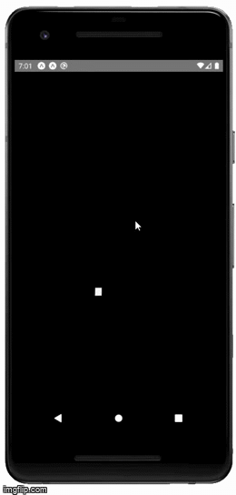
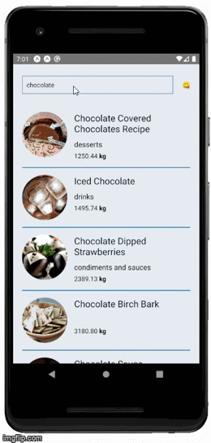

<h1>~ Recipe app ~</h1>

<h2>About it</h2>

- Mobile App build to pratice React Native.
- It is an Recipe app, where the user can search for cooks recipes.
- Has a preload screen animation.
- Home screen showing a scroll list of the requested food <b>&&</b> loading more recipes when user scrolling down.
- A recipe screen, containing a more detailed info about the selected food.
- Consuming [Edaman API](https://developer.edamam.com/) for the recipes.

<h2>Techs </h2>

- React Native
- TypeScript
- Styled-Components
- Lottie